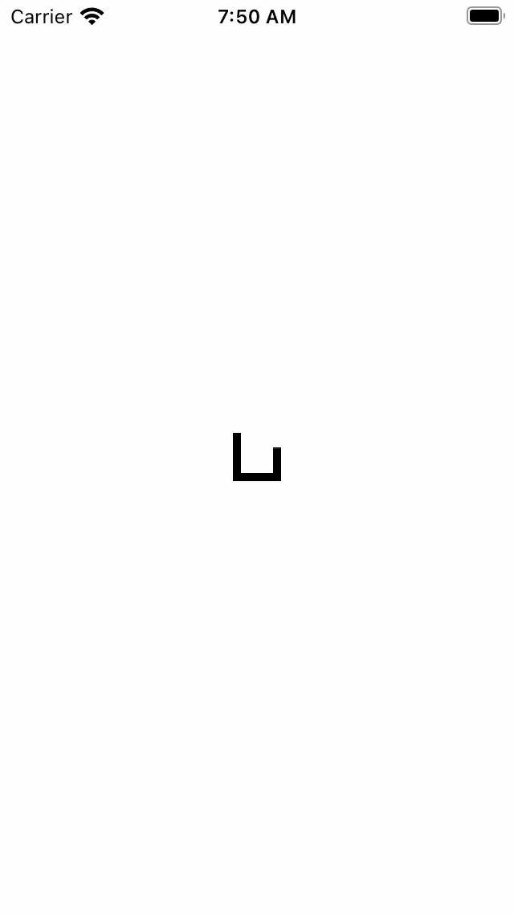

# NKOActivityIndicatorViewSPMDemo
Demo project for integrating with NKOActivityIndicatorView via Swift Package Manager 

## Environment
- macOS 12.1
- iOS 15.0
- Xcode 13.1

## Dependencies
See [Package.resolved](https://github.com/madhikarma/NKOActivityIndicatorViewSPMDemo/blob/main/NKOActivityIndicatorViewSPMDemo.xcodeproj/project.xcworkspace/xcshareddata/swiftpm/Package.resolved) for full list:
- [NKOActivityIndicatorView](https://github.com/nakiostudio/NKOActivityIndicatorView) 
  - Note. this is currently [forked](https://github.com/madhikarma/NKOActivityIndicatorView/tree/swiftpm-support) in the `swiftpm-support` branch

## Setup
- N/A

## Usage
- Open `NKOActivityIndicatorViewSPMDemo.xcodeproj`
- From the Xcode menu Product > Run

## Screenshots

